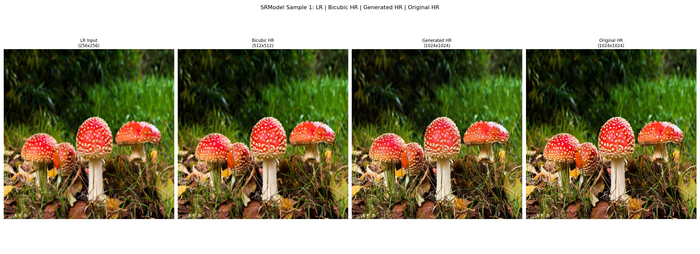
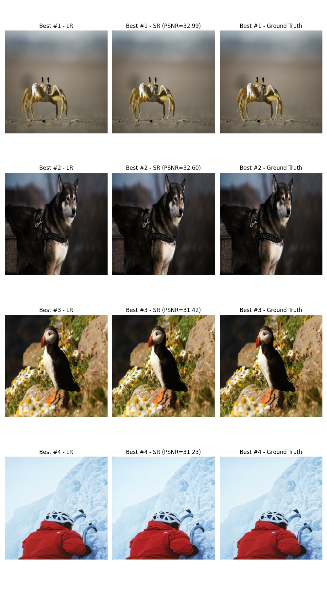
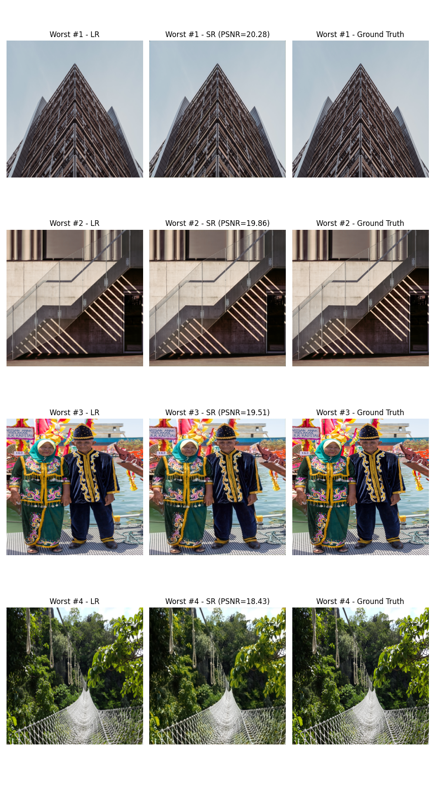
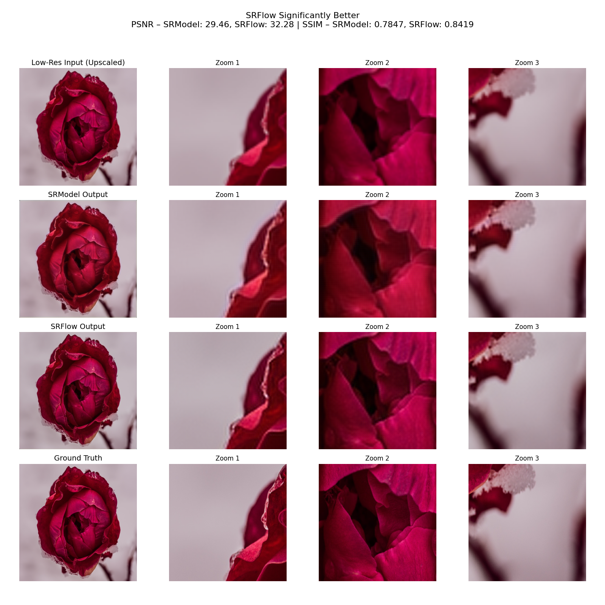

# Super-Resolution Models Comparison

This repository implements and compares Super-Resolution (SR) models: a Vanilla CNN-based model and SRFlow. It upscales low-resolution (LR) images to high-resolution (HR) and evaluates results using metrics and visualizations.

---
### Prerequisites

- Python 3.8+
- `pip`

### Clone and Install

```bash
git clone https://github.com/danielbilikId/SRFlowGenerator-for-div2k-SR.git
cd your_repo_name
python -m venv venv
source venv/bin/activate  # On Windows: venv\Scripts\activate
pip install -r requirements.txt
```

### config.py includes:
```python
EPOCHS = 10
BATCH_SIZE = 16
LEARNING_RATE = 1e-3
DEVICE = 'cuda' if torch.cuda.is_available() else 'cpu'
ALPHA = 0.1
RESIZE_HEIGHT = 256
RESIZE_WIDTH = 256
RATIO = 4
DATA_ROOT = './data'
TRAIN_HR_DIR = f'{DATA_ROOT}/DIV2K_train_HR'
VALID_HR_DIR = f'{DATA_ROOT}/DIV2K_valid_HR'
TENSOR_X_PATH = './preprocessed_data/tensor_x.npy'
TENSOR_Y_PATH = './preprocessed_data/tensor_y.npy'
VAL_TENSOR_X_PATH = './preprocessed_data/val_tensor_x.npy'
VAL_TENSOR_Y_PATH = './preprocessed_data/val_tensor_y.npy'
UPSCALE_FACTOR = 4
CHANNELS = 3
SRFLOW_NF = 64
SRFLOW_NB = 16
SRFLOW_GC = 32
```

### Project structure:
```css
├── config.py
├── download_dataset.py
├── train.py
├── evaluate.py
├── compare_models.py
├── utils/
│   ├── metrics.py
│   └── visualization.py
├── models/
│   ├── sr_vanilla_model.py
│   └── srflow_model.py
├── datasets/div2k_dataset.py
├── [model_name]_weights.pth
└── [model_name]_seed_[seed]_weights.pth
```

---

## How to run: 

### 1. Download DIV2K Dataset
```bash
python download_dataset.py
```

---

### 2. Train Models 
```bash
python train.py --model SRModel
python train.py --model SRFlowGenerator

# To resume training from earlier state:
python train.py --model SRModel --load_weights
```

**Output:**
- `SRModel_weights.pth`
- `SRModel_training_history.png`

---

### 3. Visualize Samples

```bash
python utils/visualization.py --model SRModel --num_samples 4
python utils/visualization.py --model SRFlowGenerator --num_samples 4
```

**Example Output:**



---

### 4. Evaluate Models

```bash
python evaluate.py --model SRModel
python evaluate.py --model SRFlowGenerator
```

**Best Sample (SRModel, seed 42):**



**Worst Sample (SRModel, seed 42):**



---

### 5. Compare Models

```bash
python compare_models.py --num_images 3
```

The flag `--num_images` determines how many test images to compare, highlighting where each model performs best.

**Side-by-Side Comparison:**



---
