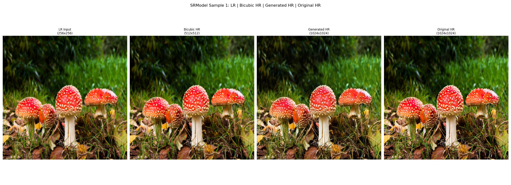
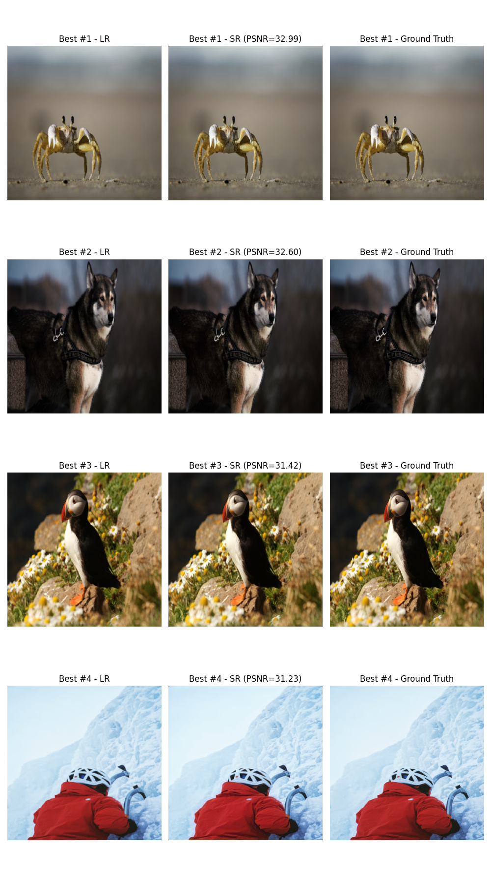
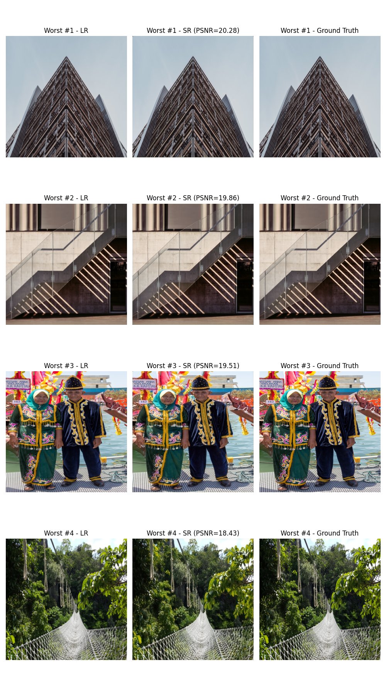
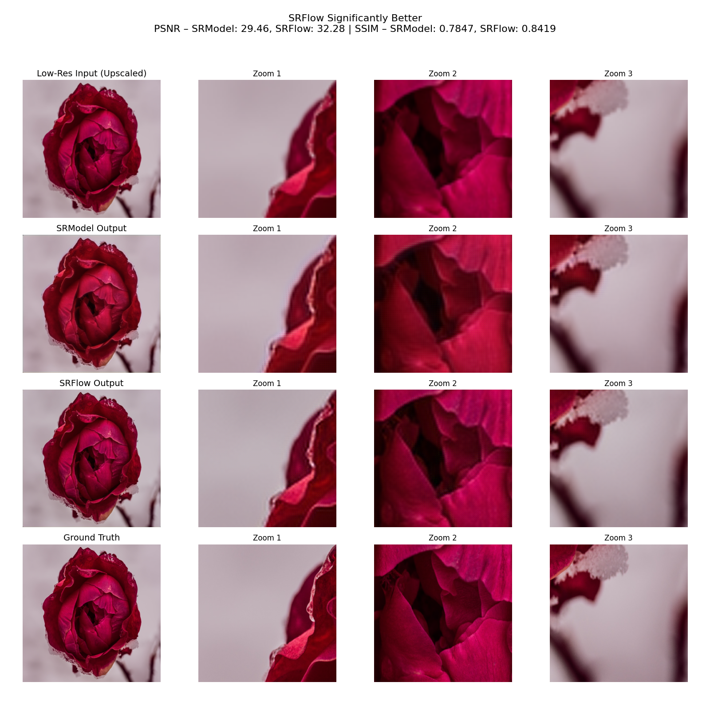

# Super-Resolution Models Comparison
#### SRFlowGenerator for div2k SR. final project of Osher Sidi and Daniel Billk for Deep Learning and its Applications to Signal and Image Processing and Analysis 361.2.1120

This repository implements and compares Super-Resolution (SR) models: a Vanilla CNN-based model and SRFlow. It upscales low-resolution (LR) images to high-resolution (HR) and evaluates results using metrics and visualizations.
This also includes ablation studies with training with a wegihted mse+mge loss 

---
### Prerequisites

- Python 3.8+
- `pip`

### Clone and Install

```bash
git clone https://github.com/danielbilikId/SRFlowGenerator-for-div2k-SR.git
cd your_repo_name
python -m venv venv
source venv/bin/activate  # On Windows: venv\Scripts\activate
pip install -r requirements.txt
```

### config.py includes:
```python
EPOCHS = 10
BATCH_SIZE = 16
LEARNING_RATE = 1e-3
DEVICE = 'cuda' if torch.cuda.is_available() else 'cpu'
ALPHA = 0.1
RESIZE_HEIGHT = 256
RESIZE_WIDTH = 256
RATIO = 4
DATA_ROOT = './data'
TRAIN_HR_DIR = f'{DATA_ROOT}/DIV2K_train_HR'
VALID_HR_DIR = f'{DATA_ROOT}/DIV2K_valid_HR'
TENSOR_X_PATH = './preprocessed_data/tensor_x.npy'
TENSOR_Y_PATH = './preprocessed_data/tensor_y.npy'
VAL_TENSOR_X_PATH = './preprocessed_data/val_tensor_x.npy'
VAL_TENSOR_Y_PATH = './preprocessed_data/val_tensor_y.npy'
TRAIN_VAL_SPLIT_PERC = 0.8
VAL_TEST_SPLIT_PERC = 0.5
UPSCALE_FACTOR = 4
CHANNELS = 3
SRFLOW_NF = 64
SRFLOW_NB = 16
SRFLOW_GC = 32
```

### Project structure:
```css
├── config.py
├── download_dataset.py
├── train.py
├── evaluate.py
├── compare_models.py
├── plot_loss.py
├── utils/
│   ├── metrics.py
│   └── visualization.py
├── models/
│   ├── sr_vanilla_model.py
│   └── srflow_model.py
├── datasets/div2k_dataset.py
├── data/
├── weights/
│   ├── [model_name]_ablated_seed_[seed]_weights.pth
│   └── [model_name]_seed_[seed]_weights.pth
```

---

## How to run: 

### 1. Download DIV2K Dataset
```bash
python download_dataset.py
```
## make sure to unload the div2k dataset into the data/ folder. 

---

### 2. Train Models 
```bash
python train.py --model SRModel
python train.py --model SRFlowGenerator
#to run ablated studies version:
python train.py --model SRFlowGenerator --ablate True

# To resume training from earlier state:
python train.py --model SRModel --load_weights
```

**Output:**
- `./weights/SRModel_weights.pth`
- `SRModel_training_history.png`
- `SRModel_training_history.npy`

training is preformed on 3 seeds: 42, 123, 789 
and each of the individuall loss histories are saved to .`/root` dir as well as the weights saved to the `./weights` folder

to not ablate either disregard the flag entirely or use:
```bash
--ablate False
```
---

### 3. Visualize Samples
```bash
python visualization.py --model SRModel --num_samples 4
python visualization.py --model SRFlowGenerator --num_samples 4
#to run ablated studies version:
python visualization.py --model SRFlowGenerator --num_samples 4 --ablate Ttue
```

**Example Output:**


---

### 4. Evaluate Models

```bash
python evaluate.py --model SRModel
python evaluate.py --model SRFlowGenerator
#to run ablated studies version:
python evaluate.py --model SRFlowGenerator --ablate Ttue
```
The evaluation code evalutes each of the seed trainings on the test set and prints out PSNR, SSIM and FID scores. for each of the seeds as well as the average. 

**Best Sample (SRModel, seed 42):**



**Worst Sample (SRModel, seed 42):**



---

### 5. Compare Models

```bash
python compare_models.py --num_images 4
```

The flag `--num_images` determines how many test images to compare, highlighting where each model performs best.

**Side-by-Side Comparison:**


---
